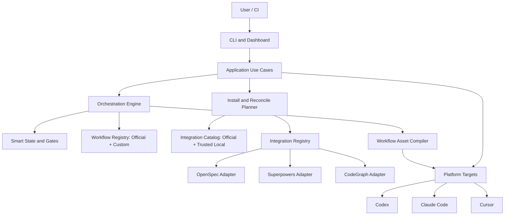

# Smart 第三方编排重构方案：官方认证与自定义流程

- 状态：Draft，已根据独立架构评审修订
- 日期：2026-07-20
- 最近修订：2026-07-21
- 目标版本：0.2.0
- 工作分支：`codex/decouple-third-party-architecture`
- 兼容策略：不兼容旧目录、旧状态格式、旧 CLI JSON 输出和旧安装结果

## 1. 决策摘要

Smart 的产品定位不是第三方无关的通用工作流引擎，也不是 OpenSpec、Superpowers、CodeGraph 的替代实现。Smart 是更贴近用户的一层，负责把经过验证的第三方工具安装好、配置好、放到正确的流程位置，并通过统一状态、守卫和上下文交接让整条链路可靠运行。

本次重构采用以下核心决策：

1. Smart 保留用户入口、流程编排、状态机、上下文交接、质量门禁、安装配置、诊断更新和卸载管理。
2. OpenSpec、Superpowers、CodeGraph 继续作为官方工作流的重要组成部分，但所有工具知识集中到认证目录、工作流配方和独立 Adapter 中。
3. Smart 提供双轨工作流：普通用户使用端到端认证的官方 preset；高级用户可以定义 custom workflow，并清楚承担未经过官方组合认证的风险。
4. `smart init` 继续提供一站式安装。默认推荐完整认证配置，也支持从声明式配置无交互初始化。
5. 第三方原生产物由对应工具管理。Smart 不复制其能力，只记录逻辑产物引用和可校验的 handoff。
6. 当前分散在 TypeScript、Markdown 和 Shell 中的状态与门禁逻辑统一收归 TypeScript 编排内核。
7. 不实现历史兼容层，不做双写、旧路径回退、字段迁移或弃用周期。
8. “经过验证”以不可变 Certification Record 表示，记录精确版本、平台环境、安装方式和测试证据，不使用开放 SemVer 范围推断兼容性。
9. 工作流不仅声明阶段 Owner，还必须定义可执行的 Stage Execution Contract，包括调用方式、输入、完成证据、重试、取消和幂等语义。
10. 安装所有权以 Smart 用户级数据目录中的持久 Machine Receipt 为准，项目内运行状态只能作为缓存。
11. Adapter 只产生类型化 Resource Action，受控执行器负责副作用、Journal、Receipt 和恢复结果。
12. 实施优先打通一个真实认证环境的纵向切片，再从真实流程提炼通用抽象。
13. 认证是支持等级，不是所有工作流的运行许可。Custom workflow 可以组合 component-verified 集成，但不能显示为 official-certified。
14. 用户自定义流程与用户自定义可执行代码分开管理：workflow YAML 不能直接嵌入任意命令；本地集成必须显式信任并继续经过 Resource Action 边界。

## 2. 问题定义

当前实现的主要问题不是使用了第三方，而是第三方知识以不可控方式散落在整个项目中：

- `init` 直接维护 `hasOS`、`hasSP`、`osAction`、`spAction` 等具名分支。
- `Platform` 直接包含 `openspecToolId`，混合了平台能力和特定集成映射。
- `detect`、`doctor`、`update`、`uninstall` 都维护固定第三方字段。
- 技能 Markdown 直接写死阶段所有者、第三方技能名称和产物目录。
- Shell 脚本直接写死 `openspec/changes`、`docs/superpowers` 和归档语义。
- 状态解析和阶段判断在 CLI、Dashboard、技能与 Shell 中重复实现。
- 所有平台被视为拥有相同集成能力，但实际上第三方与平台的兼容性是一个组合矩阵。
- 安装时使用最新版本或隐式命令，缺少已验证版本和可重现的解析结果。

这导致三个直接风险：

1. 第三方升级后，Smart 无法判断整个流程是否仍然可靠。
2. 新增或替换一个认证工具时，需要修改多个命令、类型、文案、脚本和测试。
3. 用户看到的是一键安装，但内部没有完整的安装所有权、失败恢复和组合验证模型。

## 3. 目标与非目标

### 3.1 目标

- 从干净环境开始，一条命令安装并验证完整开发工作流。
- 用户不需要理解每个第三方的安装命令、平台目录和配置格式。
- Smart 明确知道每个阶段由谁负责、需要什么输入、产生什么输出。
- 官方 preset 只使用完整认证组合，并提供一键安装和完整支持承诺。
- 高级用户可以继承官方 preset 或从头定义 workflow，组合 component-verified 集成满足特殊需求。
- 自定义流程在执行前得到结构、能力、Artifact DAG、Stage Contract 和安全校验。
- 已存在的第三方可以被检测和复用，不重复安装，也不改变所有权。
- 团队可以提交一份配置，在新机器上通过 `smart sync` 得到一致环境。
- 第三方失败时不静默降级，Smart 给出准确阻断点和可执行修复动作。
- 新增认证集成时，不需要修改状态机以及所有生命周期命令。

### 3.2 非目标

- 不提供第三方能力的 Smart 内置替代品。
- 不建设未经审核的远程公共插件市场。
- 不允许 workflow YAML 直接执行任意 Shell 命令或绕过 Resource Action Executor。
- 首个版本不承诺对 local-trusted 集成提供官方技术支持或组合兼容保证。
- 不迁移旧 `.smart.yaml`、旧目录或旧安装记录。
- 不在本次重构中引入远程动态 Catalog 服务。
- 不保证当前列出的所有 AI 平台都能运行所有官方工作流。

## 4. 实际使用场景

### 4.1 首次使用：交互式完整安装

```text
$ smart init

检测到平台：Codex、Cursor

选择工作流：
● Full Development
  OpenSpec + Superpowers + CodeGraph
○ Workflow
  OpenSpec + Superpowers
○ Custom
  继承预设或定义自己的阶段、角色与集成

安装计划：
  OpenSpec     install  project  <认证版本>
  Superpowers  install  project  <认证版本>
  CodeGraph    reuse    project  <检测版本>
  Smart        install  Codex, Cursor

确认执行？ Yes

✓ 安装第三方
✓ 配置平台
✓ 生成 Smart 工作流技能
✓ 运行健康检查
✓ 运行工作流 smoke test
```

用户只做一次选择和一次确认。Smart 负责解析依赖顺序、安装范围、版本、平台映射和健康检查。

### 4.2 快速初始化：无交互

```bash
smart init --preset full --yes
smart init --preset workflow --yes
smart init --from .smart/setup.yaml --yes
smart init --preset full --platform codex,cursor --scope project --yes
```

无交互模式必须明确提供 preset 或配置文件，避免在 CI 中发生隐式全局安装。

### 4.3 团队成员拉取项目

仓库提交 `.smart/setup.yaml` 和 `.smart/integrations.lock.yaml`。新成员运行：

```bash
smart sync
```

Smart 比较期望状态与当前机器状态，生成并执行 reconcile plan：复用已有组件、安装缺失组件、验证支持等级、重新生成平台配置并运行健康检查。官方流程的认证环境不匹配时阻断；自定义流程按其 trust policy 决定阻断或显式确认。

### 4.4 已经安装第三方

Smart 检测命令位置、版本、配置和平台资产。官方流程要求与目标 Certification Record 精确一致；Custom 要求匹配 Component Verification Record，或通过 local-trusted 明确授权。满足当前模式的解析条件后标记为 `adopted`，不重复安装，并在持久 Machine Receipt 中记录 `managed_by_smart: false`。后续卸载不会删除该组件。

### 4.5 官方流程中的第三方版本不受支持

Smart 不自动尝试运行：

```text
BLOCKED INTEGRATION_VERSION_UNVERIFIED

OpenSpec 2.x 尚未通过 Smart 0.2.0 的 Full Development 验证。
支持范围：<Catalog 中的范围>

可执行操作：
1. 在项目隔离环境安装认证版本
2. 取消本次初始化
```

Smart 不自动替换用户的全局版本，也不依赖 PATH 猜测最终命令。若 Adapter 支持项目隔离安装，则使用 Certification Record 中的精确版本和显式 executable；若上游不支持并存，则阻断并说明冲突。

高级用户可以在 Custom workflow 中把未进入官方记录的版本作为 local-trusted 使用，但必须提供声明式 Manifest、锁定精确来源与完整性并完成本机授权；该选择不会改变官方 preset 的认证状态。

### 4.6 平台组合不受支持

官方支持关系按“工作流 + 平台 + 集成版本”判断，而不是只看平台名称。未经完整验证的组合不作为官方 preset 展示。高级用户仍可创建 custom workflow，但界面必须显示 `custom-unverified`，并逐项列出 component verification、缺失保证和所需确认。

### 4.7 平台只能通过指令驱动第三方

Certification Record 明确标记自动化级别。对无法程序化调用第三方技能的平台，Smart 使用 `instruction-driven` Stage Execution Contract：Smart 保证上下文注入、明确 checkpoint 和完成证据校验，但不会宣称自动执行了第三方能力。CLI 和 Dashboard 必须显示“引导执行”，不能显示“自动完成”。

### 4.8 高级用户自定义流程

```bash
smart workflow create team-flow --extends official/full
smart workflow validate .smart/workflows/team-flow.yaml
smart init --workflow team-flow
```

Custom workflow 可以关闭、增加或重排阶段，重新绑定 Owner/assistant，调整 gate，并选择 component-verified 集成。它也可以引用显式授权的 local-trusted 集成。Smart 继续管理状态、handoff、安装所有权和副作用安全，但不承诺该组合通过了官方端到端测试。

## 5. 产品职责边界

| 层级        | 所有职责                                                                                  |
| ----------- | ----------------------------------------------------------------------------------------- |
| Smart       | 用户入口、阶段编排、状态、门禁、handoff、安装计划、配置、健康检查、版本兼容、恢复和可视化 |
| OpenSpec    | 需求拆解、规范、增量规范及其原生归档语义                                                  |
| Superpowers | 设计、计划、TDD、任务执行、调试和评审方法                                                 |
| CodeGraph   | 结构化代码理解、调用路径和影响分析                                                        |
| AI 平台     | Agent 执行环境、技能承载、Rules、Hooks 和平台交互                                         |

Smart 不接管第三方原生产物。Smart 通过 Artifact Contract 将不同工具的产物映射为流程中的逻辑角色，例如 `proposal`、`design`、`plan`、`verification-evidence`。

## 6. 目标架构



### 6.1 建议目录

```text
src/
  domain/
    workflow.ts
    state.ts
    artifacts.ts
    diagnostics.ts
  application/
    init-project.ts
    sync-environment.ts
    transition-change.ts
    verify-change.ts
    archive-change.ts
    update-environment.ts
    uninstall-environment.ts
  orchestration/
    engine.ts
    recipe-loader.ts
    workflow-validator.ts
    stage-execution.ts
    gate-runner.ts
    handoff-service.ts
    asset-compiler.ts
  integration-kit/
    adapter.ts
    manifest.ts
    certification.ts
    component-verification.ts
    trust-policy.ts
    registry.ts
    install-plan.ts
    artifact-contract.ts
    resource-action.ts
  integrations/
    openspec/
    superpowers/
    codegraph/
  platforms/
    target.ts
    registry.ts
    installers/
  infrastructure/
    command-runner.ts
    file-store.ts
    yaml-store.ts
    operation-journal.ts
    machine-receipt-store.ts
    resource-lock.ts
  bootstrap/
    official-catalog.ts
    official-recipes.ts
    local-integration-loader.ts
    container.ts
  commands/
  dashboard/

assets/
  workflows/
    official/
  integrations/
    openspec/{en,zh}/
    superpowers/{en,zh}/
    codegraph/{en,zh}/
  smart/
    base/{en,zh}/
```

项目自定义流程位于 `.smart/workflows/*.yaml`；项目本地集成位于 `.smart/integrations/<id>/`，必须通过显式 trust policy 才能加载。

### 6.2 依赖规则

- `domain` 不导入 Adapter、平台、文件系统或命令执行模块。
- `application` 依赖领域接口和 Registry，不按集成 ID 分支。
- `IntegrationManifest` 是集成元数据的唯一权威来源；Adapter 只实现命令性行为，recipe 只引用 Manifest 中声明的 ID。
- 第三方包名、命令、目录、环境变量和版本规则只能出现在对应 Manifest、Adapter、Verification/Certification Record 或 workflow recipe 中。
- `bootstrap` 是唯一允许显式组合具名 Adapter 的代码位置。
- Custom workflow 只能引用 Registry 中已加载的 IntegrationManifest；local-trusted Manifest 由独立 Loader 和 trust policy 注册，并由内置 Declarative Adapter 执行，不能修改 bootstrap。
- 所有外部进程统一经过 `CommandRunner`，业务代码不能直接使用 `child_process`。
- 所有状态读写统一经过 `StateStore`，CLI、Dashboard 和 Hook 不自行解析 YAML。
- Adapter 不直接执行安装、更新和删除，只返回 `ResourceAction[]` 交给受控执行器。
- 依赖边界通过 ESLint 规则和架构测试同时约束。

## 7. 集成验证与信任模型

### 7.1 能力分类

```typescript
export type IntegrationCapability =
  | 'requirements'
  | 'specification'
  | 'design'
  | 'planning'
  | 'implementation'
  | 'review'
  | 'verification'
  | 'archive'
  | 'code-intelligence';
```

能力只用于工作流约束和可视化。Smart 不根据能力自动选择任意工具，实际绑定必须来自认证 workflow recipe。

### 7.2 Integration Manifest：唯一元数据来源

```typescript
export interface IntegrationManifest {
  id: IntegrationId;
  displayName: string;
  capabilities: IntegrationCapability[];
  distributionSources: DistributionSource[];
  installScopes: InstallScope[];
  platformMappings: Record<PlatformId, PlatformIntegrationMapping>;
  artifactContracts: Record<ArtifactContractId, ArtifactContract>;
  stageContributions: Record<StageContributionId, StageContribution>;
  healthChecks: HealthCheckDefinition[];
  optionSchema: JsonSchema;
}
```

Manifest 声明能力、发行来源、平台映射、产物契约、工作流贡献和健康检查，是这些信息的唯一权威来源。Catalog、Asset Compiler 和文档均从 Manifest 与 Certification Record 装配或生成，不再重复维护同一信息。

### 7.3 Adapter：命令性行为

```typescript
export interface IntegrationAdapter {
  readonly manifestId: IntegrationId;

  detect(context: DetectionContext): Promise<DetectionResult>;
  planInstall(context: InstallContext): Promise<ResourceAction[]>;
  planConfigure(context: ConfigureContext): Promise<ResourceAction[]>;
  healthCheck(context: HealthContext): Promise<Diagnostic[]>;
  planUpdate(context: UpdateContext): Promise<ResourceAction[]>;
  planUninstall(context: UninstallContext): Promise<ResourceAction[]>;

  prepareStage(context: StageContext): Promise<StagePreparation>;
  executeStage?(context: StageContext): Promise<StageInvocationResult>;
  observeStage(context: StageContext): Promise<StageObservation>;
}
```

Adapter 不能直接执行 lifecycle 副作用，也不能直接打印用户文案。安装、配置、更新和卸载只返回类型化 Resource Action；Stage 执行必须使用 Manifest 声明并被当前 trust level 允许的调用模式。CLI 和 Dashboard 使用统一 presenter 展示 Action、Observation 和 Diagnostic。

### 7.4 Certification Record：不可变认证事实

```yaml
id: cert-full-codex-<platform-version>-<os>-<arch>-001
smart_version: 0.2.0
recipe:
  id: full
  digest: <sha256>
platforms:
  - id: codex
    client_version: <exact>
environment:
  os: <exact>
  arch: <exact>
  runtime_versions:
    node: <exact>
integrations:
  openspec:
    manifest_digest: <sha256>
    adapter_version: <exact>
    upstream_version: <exact>
    distribution:
      type: npm
      package: <exact-package>
      integrity: <sha512>
    install_mode: project-isolated
  superpowers:
    manifest_digest: <sha256>
    adapter_version: <exact>
    upstream_version: <exact>
    distribution:
      type: verified-installer
      source: <exact-source>
      integrity: <sha256>
    install_mode: project
  codegraph:
    manifest_digest: <sha256>
    adapter_version: <exact>
    upstream_version: <exact>
    distribution:
      type: npm
      package: <exact-package>
      integrity: <sha512>
    install_mode: project-isolated
evidence:
  suite_version: <exact>
  run_id: <immutable-id>
  completed_at: <timestamp>
  result_digest: <sha256>
```

Certification Record 是一次真实测试通过后的不可变事实。运行时只能选择精确 Record，不根据 SemVer 范围自动接纳未来版本。版本范围可以用于提示候选版本，但不能授予 `verified` 状态。

团队可能同时使用多个 OS、架构或平台客户端版本，因此官方 preset 指向 Certification Bundle。Bundle 只聚合一组分别通过 E2E 的精确 Record，并为每条 Record 声明 environment selector；它不能把一个环境的认证推断到另一个环境。

```typescript
export interface CertificationBundle {
  id: CertificationBundleId;
  digest: Sha256;
  workflowId: WorkflowId;
  records: Array<{
    selector: EnvironmentSelector;
    certificationId: CertificationRecordId;
    certificationDigest: Sha256;
  }>;
}
```

官方 Catalog 是当前 Smart 版本随包发布的 Manifest、Component Verification Record 与 Certification Record 索引。它不是第三套元数据源，也不在运行时从远程扩展。

Component Verification Record 记录单个 Adapter 在精确平台和环境下通过的能力、生命周期和 Stage Contract 测试，但不证明任意 workflow 组合正确：

```typescript
export interface ComponentVerificationRecord {
  id: ComponentVerificationRecordId;
  manifestDigest: Sha256;
  adapterVersion: ExactVersion;
  upstreamVersion: ExactVersion;
  platform: PlatformEnvironment;
  verifiedCapabilities: IntegrationCapability[];
  verifiedStageContracts: StageExecutionContractId[];
  evidenceDigest: Sha256;
}
```

### 7.5 官方认证要求

第三方进入官方 Catalog 必须满足：

1. 有明确的上游来源和许可证记录。
2. 有固定的 Adapter 负责人、精确发行版本和完整性摘要。
3. 安装、检测、配置、更新、健康检查和卸载都具备测试。
4. 每个支持平台均有集成测试，不以其他平台结果推断兼容性。
5. 产物路径、格式、完成条件和归档行为有 Artifact Contract。
6. 每个 Stage Execution Contract 的调用、checkpoint 和完成证据可观察。
7. 中英文工作流贡献均通过渲染验证。
8. 完整 workflow recipe 在明确的平台客户端、OS、架构和安装方式上通过端到端测试。
9. 全局安装、网络访问、脚本执行和文件删除行为经过安全审查。
10. 测试证据写入 Certification Record，发布后不可原地修改。

### 7.6 支持等级和信任模型

| 支持等级             | 来源                                             | Smart 承诺                                                        |
| -------------------- | ------------------------------------------------ | ----------------------------------------------------------------- |
| `official-certified` | 官方 recipe + Certification Bundle               | 一键安装、精确版本、完整 E2E、升级路径和官方问题支持              |
| `component-verified` | Custom workflow + 官方 Component Verification    | 单组件能力和生命周期经过验证，组合仅做静态/运行时校验，不承诺 E2E |
| `local-trusted`      | 用户显式信任的本地声明式 Manifest                | Smart 只提供 Schema、Resource Action 和运行时门禁，不保证组件正确 |
| `invalid`            | 缺能力、依赖断裂、无完成证据或越过安全边界的配置 | 禁止运行                                                          |

Custom workflow 的整体支持等级取其所有依赖的最低等级。包含 `local-trusted` 集成时，每个新内容摘要首次运行都必须重新确认；修改本地 Manifest 或 Stage Contract 后原信任自动失效。

`local-trusted` 不等于任意 workflow YAML 命令。当前落地版本采用更保守的 `user-managed` 模式：本地 Manifest 只能声明 capability、Stage Contract 和平台 tool/agent 映射，不允许命令模板、脚本或代码；Smart 只负责编排、状态和诊断，不执行安装、更新或卸载。Manifest 信任绑定用户级 trust store 中的精确 SHA-256，内容变化后立即失效，并且仅支持项目作用域。受限参数数组命令模板推迟到 Resource Action Executor、effect boundary 和 Operation Journal 完成后再开放；代码型本地 Adapter 留待后续 Sandbox 方案。

## 8. 工作流配方：官方与 Custom

### 8.1 配方结构

```yaml
id: full
display_name: Full Development
required_integrations:
  - openspec
  - superpowers
  - codegraph
stages:
  issue:
    coordinator: smart
    owner: openspec
    assistants: [codegraph]
    execution_contract: openspec.issue.instruction-driven.v1
    required_inputs: [user-request]
    required_outputs: [proposal, specification-delta, task-list]
  design:
    coordinator: smart
    owner: superpowers
    participants: [openspec]
    assistants: [codegraph]
    execution_contract: superpowers.design.instruction-driven.v1
    required_inputs: [proposal, specification-delta, task-list]
    required_outputs: [design-document, refined-task-list]
  build:
    coordinator: smart
    owner: superpowers
    assistants: [codegraph]
    execution_contract: superpowers.build.instruction-driven.v1
    required_inputs: [design-document, refined-task-list]
    required_outputs: [implementation, test-evidence, review-evidence]
  verify:
    coordinator: smart
    executors: [superpowers, openspec]
    assistants: [codegraph]
    execution_contract: smart.verify-coordination.v1
    required_inputs: [implementation, test-evidence, review-evidence]
    required_outputs: [verification-report]
  archive:
    coordinator: smart
    owner: openspec
    execution_contract: openspec.archive.instruction-driven.v1
    required_inputs: [verification-report]
    required_outputs: [archived-change]
```

`owner` 或 `executors` 表示实际完成阶段专业工作的第三方；Smart 始终是 coordinator 和 gate owner，负责入口、状态、调用编排、handoff、完成证据和结果确认。Verify 阶段没有把 Smart 伪装成专业执行者，Smart 只汇总并裁决第三方提供的验证证据。

### 8.2 Stage Execution Contract

```typescript
export interface StageExecutionContract {
  id: StageExecutionContractId;
  phase: WorkflowPhase;
  mode: 'programmatic' | 'instruction-driven';
  roles: StageRoleBinding[];
  platformRequirements: PlatformRequirement[];
  inputSelectors: ArtifactSelector[];
  invocation: ProgrammaticInvocation | InstructionCheckpoint[];
  completionEvidence: EvidenceRequirement[];
  retryPolicy: RetryPolicy;
  cancellation: CancellationPolicy;
  timeoutMs?: number;
  idempotencyKey: IdempotencyKeyTemplate;
}
```

执行顺序固定为：

1. Smart 验证 entry gate 和 Resolved Workflow。官方流程校验 Certification Record；Custom 流程校验 Component Verification 与 trust policy。
2. Smart 解析 Artifact Descriptor，生成本次 Stage 的不可变输入快照。
3. Adapter 执行 `prepareStage`，返回调用资料和 checkpoint。
4. `programmatic` 模式由 Adapter 的 `executeStage` 执行；`instruction-driven` 模式由已编译技能引导 Agent，并在每个 checkpoint 写入可观察状态。
5. Adapter 执行 `observeStage`，Smart 校验 completion evidence。
6. 只有证据满足 Contract 时，Smart 才提交输出 Artifact Descriptor 和状态转换。

对于 `instruction-driven` 平台，Smart 的承诺是“已提供正确指令和上下文、已观察到声明证据、已通过门禁”，不是“Smart 自动调用并完成了第三方”。重试复用同一 idempotency key；取消后状态保持在当前阶段并记录最后一个完成 checkpoint。

### 8.3 官方首批配方

| Preset     | 必需集成                         | 目标场景                   |
| ---------- | -------------------------------- | -------------------------- |
| `full`     | OpenSpec、Superpowers、CodeGraph | 默认推荐，完整研发流程     |
| `workflow` | OpenSpec、Superpowers            | 不需要结构化代码索引的仓库 |

不提供 `smart-only` 工作流。缺少阶段 Owner 的组合不是有效工作流。

### 8.4 Custom Workflow Schema

推荐通过单继承修改官方流程：

```yaml
version: 1
id: team-flow
kind: custom
extends: official/full
support_policy:
  allow_component_verified: true
  allow_local_trusted: false
integrations:
  openspec:
    source: official
  superpowers:
    source: official
  codegraph:
    source: official
stages:
  security-review:
    kind: user-checkpoint
    depends_on: [build]
    required_inputs: [implementation, review-evidence]
    required_outputs: [security-approval]
    prompt: Confirm security review before verification
  verify:
    depends_on: [security-review]
    executors: [superpowers, openspec]
    required_inputs: [implementation, test-evidence, review-evidence, security-approval]
    gates: [tests-pass, user-confirmation]
```

高级用户也可以不使用 `extends`，从头声明 integrations、stages、Artifact 输入输出、gate 和 Stage Execution Contract。Stage kind 支持 `integration`、`user-checkpoint` 和 `gate`；后两者由 Smart 协调，但整个 workflow 至少包含一个第三方 integration stage，因此不会退化成 smart-only 流程。每个 Custom workflow 最多继承一个父流程，避免多继承优先级；解析后生成完整不可变的 Resolved Workflow 和 digest。

继承官方 preset 后一旦产生任何语义覆盖，整体支持等级立即变为 `component-verified` 或 `local-trusted`，不能继续显示 `official-certified`。

### 8.5 Custom Workflow 校验

`smart workflow validate` 至少执行：

1. workflow ID、stage ID 和 integration 引用存在且唯一。
2. 阶段依赖图无环，入口可达且至少存在一个终止阶段。
3. 每个 `integration` 阶段都有 Owner 或 executor，且 Manifest 声明对应 capability；内置 checkpoint/gate 类型符合 Smart Schema。
4. 每个 required artifact 都有上游 producer 或显式 external input。
5. 关闭或重排阶段后，Artifact DAG 仍然连通。
6. 每个 Stage Execution Contract 都有可观察 completion evidence。
7. programmatic 调用和 Resource Action 没有超出 Manifest effect boundary。
8. local-trusted 内容摘要已得到当前用户显式授权。
9. workflow YAML 不包含裸命令、包 URL、动态代码或未注册 Adapter。
10. 整个 workflow 至少存在一个第三方 integration stage。

结构错误、缺失能力、Artifact 断裂或越界副作用将 workflow 标记为 `invalid` 并阻断。仅缺少组合 E2E 时标记为 `custom-unverified`，展示风险摘要后允许执行；非交互模式要求配置显式 `accept_custom_risk: true`。

### 8.6 工作流资产组合

当前完整技能文件直接写入所有第三方细节，后续应改为可验证的编译过程：

1. Smart 提供阶段骨架：入口条件、状态转换、用户确认点和错误处理。
2. Workflow Resolver 将官方 recipe 或 Custom workflow 解析为完整不可变模型。
3. Resolved Workflow 决定每个阶段加载哪些集成贡献。
4. Integration Manifest 提供中英文指令片段、Artifact Contract 和平台调用映射 ID。
5. Asset Compiler 合成最终的 Smart skills、rules 和 hooks。
6. 编译结果包含 workflow digest、support level、Manifest、Verification/Certification Record 和内容摘要，用于 `smart sync` 判断是否需要重建。

指令片段不能包含未声明的命令、路径或第三方依赖。编译器对变量、引用和阶段输出执行静态校验。

## 9. 平台模型

### 9.1 平台目标只描述承载能力

```typescript
export interface PlatformTarget {
  id: PlatformId;
  displayName: string;
  detectionPaths: string[];
  scopes: InstallScope[];
  skills: SkillTarget;
  rules?: RuleTarget;
  hooks?: HookTarget;
}
```

`PlatformTarget` 不包含 `openspecToolId`、Superpowers agent ID 或其他第三方字段。第三方映射从对应 Integration Manifest 解析。

### 9.2 官方认证矩阵

验证单元是：

```text
Smart version
  + workflow recipe digest
  + platform and client version
  + OS and architecture
  + integration manifest and adapter versions
  + exact upstream distributions and integrity
  + install modes
```

每个矩阵单元对应一个 Certification Record。只有存在精确 Record 的组合才能标记为 `official-certified`；不能用单个集成的验证结果推断新组合。

### 9.3 Custom 解析

Custom workflow 不要求组合级 Certification Record。Resolver 按当前平台和环境为每个官方集成选择精确 Component Verification Record，再校验 workflow DAG、Stage Contract 和 Artifact Contract。只要结构与安全校验通过，未做组合 E2E 也可以运行；其 `support_level` 为 `component-verified`，同时产生 `custom-unverified` 风险提示。

包含 local-trusted 集成时，Resolver 将本地 Manifest、命令模板、Stage Contract 和 workflow 内容摘要写入 lock，并把整体等级降为 `local-trusted`。无法解析精确组件版本、缺少必要 capability 或 effect boundary 无效时仍然阻断。

## 10. 配置、锁定与状态

### 10.1 用户期望配置

`.smart/setup.yaml` 是可提交到仓库的期望状态：

```yaml
version: 1
workflow:
  mode: official
  source: official/full
language: zh
scope: project
platforms:
  - codex
  - cursor
integration_options:
  openspec:
    scope: project
  superpowers:
    scope: project
  codegraph:
    scope: project
    initialize_index: true
```

Custom 项目引用仓库内 workflow：

```yaml
version: 1
workflow:
  mode: custom
  source: .smart/workflows/team-flow.yaml
  accept_custom_risk: true
language: zh
scope: project
platforms:
  - codex
```

配置描述 workflow 来源、平台、语言、作用域和有限选项，不直接指定版本或包来源。官方模式只接受 Certification Bundle 覆盖的选项；Custom 模式接受所引用 Manifest 声明的选项。两种模式都不接受裸命令、动态代码或绕过 Adapter 的包 URL。

`accept_custom_risk` 只接受“组合没有官方 E2E 保证”，不授权 local-trusted 命令执行。Local integration 的信任记录保存在用户级 trust store，并绑定 Manifest、命令模板和 Stage Contract 内容摘要；内容变化后必须重新授权。

### 10.2 解析锁定文件

`.smart/integrations.lock.yaml` 记录可提交、可重现的完整目标解析结果，不记录机器所有权：

```yaml
schema_version: 1
smart_version: 0.2.0
generator_version: <exact>
resolution_mode: official
workflow:
  source: official/full
  digest: <sha256>
  support_level: official-certified
certification_bundle:
  id: <exact-bundle-id>
  digest: <sha256>
language: zh
environment_resolutions:
  darwin-arm64:
    selector:
      os: darwin
      arch: arm64
    certification:
      id: <exact-certification-id>
      digest: <sha256>
    recipe:
      id: full
      digest: <sha256>
    platforms:
      codex:
        client_version: <exact>
        target_digest: <sha256>
        generated_assets_digest: <sha256>
      cursor:
        client_version: <exact>
        target_digest: <sha256>
        generated_assets_digest: <sha256>
    integrations:
      openspec:
        manifest_digest: <sha256>
        adapter_version: <exact>
        upstream_version: <exact>
        distribution:
          package: <exact-package>
          integrity: <sha512>
        scope: project
        resolved_options: {}
      superpowers:
        manifest_digest: <sha256>
        adapter_version: <exact>
        upstream_version: <exact>
        distribution:
          source: <exact-source>
          integrity: <sha256>
        scope: project
        resolved_options: {}
      codegraph:
        manifest_digest: <sha256>
        adapter_version: <exact>
        upstream_version: <exact>
        distribution:
          package: <exact-package>
          integrity: <sha512>
        scope: project
        resolved_options:
          initialize_index: true
```

Lock 保存 Certification Bundle，并为团队支持的每个 environment selector 保存一个完整精确解析：Certification ID、recipe digest、平台客户端版本、每个平台生成资产摘要、精确发行来源与完整性、作用域以及解析后的 Adapter 选项。示例只展开一个环境；其他环境使用同一结构且必须对应独立认证记录。它不保存 adopted/managed 所有权、绝对主目录、Token、环境变量值或其他机器信息。

Custom workflow 的 lock 使用相同环境分层，但不包含 Certification Bundle：

```yaml
schema_version: 1
smart_version: 0.2.0
generator_version: <exact>
resolution_mode: custom
workflow:
  source: .smart/workflows/team-flow.yaml
  digest: <sha256>
  support_level: component-verified
environment_resolutions:
  darwin-arm64:
    selector:
      os: darwin
      arch: arm64
    platforms:
      codex:
        client_version: <exact>
        generated_assets_digest: <sha256>
    components:
      openspec:
        verification_record:
          id: <exact-component-verification-id>
          digest: <sha256>
        manifest_digest: <sha256>
        adapter_version: <exact>
        upstream_version: <exact>
        distribution_integrity: <sha512>
    local_integrations: {}
```

若包含 local-trusted 集成，`local_integrations` 记录其 Manifest、命令模板、Stage Contract 和分发内容摘要，但不记录“已信任”布尔值。实际执行仍需当前机器 trust store 中存在匹配这些摘要的授权。

`smart sync` 只消费 lock，不改变目标版本。`smart update` 在用户确认后生成新的 lock 作为普通工作区改动，由团队通过代码评审提交。CI 使用 `smart sync --check` 检测 lock 漂移。当前 Smart 无法理解更高 `schema_version` 时必须以 `LOCK_SCHEMA_UNSUPPORTED` 阻断，并建议升级 Smart，不能猜测解析。

### 10.3 Machine Receipt 与本机缓存

安装和卸载所有权的权威记录位于用户级 Smart 数据目录：

```text
$SMART_HOME/
  receipts/
    projects/<sha256-canonical-project-path>/<resource-id>.json
    global/<resource-id>.json
  trust/
    projects/<sha256-canonical-project-path>/<integration-id>/<content-digest>.json
```

每条 Machine Receipt 至少包含：

```yaml
schema_version: 1
resource_id: <stable-resource-id>
integration_id: openspec
scope: project
project:
  canonical_path: <machine-local-realpath>
  setup_lock_fingerprint: <sha256>
ownership:
  source: managed
  managed_by_smart: true
action:
  operation_id: <operation-id>
  created_at: <timestamp>
pre_state:
  existed: false
  digest: null
post_state:
  locator: <machine-local-path>
  version: <exact>
  digest: <sha256>
consumers:
  - <project-identity>
```

项目内 `.smart/runtime/environment.yaml` 仅作为检测缓存，可以根据 setup、lock、Machine Receipt 和实时探测重建。删除动作必须同时满足：Receipt 存在、`managed_by_smart: true`、当前资源与 Receipt 的 post-state 匹配。Receipt 缺失、损坏或资源发生漂移时，Smart 一律禁止自动删除，只输出诊断并提供显式接管或手动清理流程。

全局 Receipt 维护引用该资源的项目 consumers。只要仍有项目引用，Smart 就不能升级到冲突版本或删除资源。项目移动后不自动猜测身份，`smart doctor --relink <old-path>` 在用户确认后迁移 Receipt。

### 10.4 Change 状态

Smart 只拥有流程状态和交接资料：

```text
smartdocs/
  workflows/
    <workflow-digest>.yaml
  changes/<change>/
    state.yaml
    handoff/
    verification/
  archive/<change>/
```

`state.yaml` 使用逻辑产物引用，不复制第三方产物：

```yaml
schema_version: 1
workflow:
  id: full
  digest: <sha256>
  support_level: official-certified
phase: design
status: active
artifacts:
  proposal:
    descriptor_id: <stable-id>
    provider: openspec
    contract_id: openspec.proposal.v1
    revision: <provider-revision>
    content_digest: <sha256>
    producer_version: <exact>
    locator: change:example/proposal
    archived_locator: null
  design_document:
    descriptor_id: <stable-id>
    provider: superpowers
    contract_id: superpowers.design.v1
    revision: <provider-revision>
    content_digest: <sha256>
    producer_version: <exact>
    locator: design:example
    archived_locator: null
handoff:
  from: issue
  to: design
  execution_contract: superpowers.design.instruction-driven.v1
  input_artifact_digests:
    - <sha256>
  payload_digest: <sha256>
verification:
  result: pending
```

Artifact Descriptor 是产物进入某阶段时的不可变快照，包含 provider identity、contract、revision、内容摘要、producer version、当前 locator 和归档后 locator。具体文件路径由 Artifact Contract 解析，状态机不依赖 `openspec/changes` 或 `docs/superpowers`。

handoff digest 的计算对象固定为：排序后的输入 Artifact Descriptor、Contract ID、Stage Execution Contract ID、注入上下文和 Smart 生成器版本。第三方产物改变后必须生成新 Descriptor，不能原地更新旧摘要。

每个 change 创建时把完整 Resolved Workflow 快照写入 `smartdocs/workflows/<digest>.yaml`，并在 state 中绑定 digest。`smart workflow use` 只改变新 change 的默认流程和平台生成资产，不修改活跃 change；0.2.0 不提供活跃 change 的 workflow rebind，避免阶段和 Artifact 语义在执行中漂移。

## 11. 初始化与同步执行模型

### 11.1 初始化阶段

1. `Discover`：检测项目、语言、AI 平台、现有第三方和安装范围。
2. `Resolve`：官方流程解析 Certification Bundle；Custom 流程解析 workflow、Component Verification 和 local trust。
3. `Plan`：生成有序 Action Graph，标记 `reuse/install/configure/skip/block`。
4. `Confirm`：展示准确版本、完整性、资源影响、可逆性、安装范围和文件目标。
5. `Execute`：按依赖顺序执行；每个 Action 前写 Journal，成功后立即持久化 pending Machine Receipt。
6. `Compose`：根据 workflow recipe 合成 Smart skills、rules 和 hooks。
7. `Verify`：运行 Adapter health checks；官方流程校验 Certification，Custom 流程运行 validator、trust checks 和 workflow smoke test。
8. `Commit`：原子写入 setup、lock 和生成资产摘要，并把本次 pending Receipt 标记为 committed。

### 11.2 Action Graph

安装计划不是固定顺序的 if/else，而是依赖图：

```text
resolve catalog
  -> install/adopt integrations
  -> configure integration for platforms
  -> compile workflow assets
  -> install Smart assets to platforms
  -> integration health checks
  -> workflow smoke test
  -> write lock
```

每个 Action 都有稳定 ID、前置依赖、资源边界、前置状态、预期后置状态、完整性、补偿方式、point-of-no-return 和用户可读摘要。

```typescript
export interface ResourceAction {
  id: ActionId;
  kind:
    | 'write-file'
    | 'remove-owned-file'
    | 'adopt-existing'
    | 'install-package'
    | 'run-verified-installer'
    | 'configure-platform'
    | 'generate-assets';
  resourceId: ResourceId;
  scope: 'project' | 'global';
  dependencies: ActionId[];
  preconditions: ResourceAssertion[];
  effectBoundary: ResourceBoundary;
  distributionIntegrity?: Integrity;
  expectedPostState: ResourceAssertion[];
  recovery: 'automatic' | 'compensating' | 'manual-only';
  compensation?: CompensatingAction;
  pointOfNoReturn: boolean;
}
```

受控 Executor 是 lifecycle 副作用的唯一执行入口。对于无法枚举全部副作用的第三方安装器，Action 必须使用 `run-verified-installer`，声明已认证的 effect boundary，并标记 `manual-only` 或补偿动作；不能仅设置一个 `rollbackable: true` 就承诺完全回滚。

### 11.3 失败恢复

- 每个 Action 执行前将 pre-state、备份位置和意图写入 `.smart/runtime/operations/<operation-id>.json`。
- 只恢复本次由 Smart 改变且有可信 pre-state 的资源，不修改 adopted 组件。
- 到达 point-of-no-return 前再次确认不可逆动作。官方无交互模式要求 Certification Record 和显式 `--yes`；Custom 还要求锁定 workflow digest、`accept_custom_risk` 以及匹配内容摘要的既有 trust 记录。`--yes` 不能创建 local-trusted 的首次授权。
- 全局安装失败不继续执行后续平台配置。
- 健康检查失败时保留 Journal，支持 `smart sync --resume <operation-id>`。
- Lock 只在所有 required checks 通过后更新。
- Primary operation status 与 recovery status 分开：操作可以是 `failed`，恢复可以是 `complete/partial/not-attempted`，不能用 `rolled_back` 掩盖原始失败。
- `manual-only` Action 失败时输出准确已知副作用、Receipt、备份和人工恢复步骤。

### 11.4 并发与资源锁

- 项目操作使用项目锁；共享工具、全局包和全局配置使用 `$SMART_HOME/locks/<resource-id>.lock`。
- 固定加锁顺序为：全局资源 ID 字典序，然后项目锁；释放顺序相反，禁止 Adapter 自行加锁。
- Lock 内容记录 operation ID、PID、host、启动时间和心跳。
- 检测到活跃 Lock 时返回 `CONCURRENT_OPERATION_BLOCKED`，不并发修改同一资源。
- stale Lock 只能通过 `smart doctor --recover-lock` 在确认对应进程不存在且 Journal 可恢复后清理。

## 12. CLI 设计

### 12.1 命令职责

| 命令                                     | 行为                                                    |
| ---------------------------------------- | ------------------------------------------------------- |
| `smart init`                             | 首次选择 workflow、解析并安装完整环境                   |
| `smart sync`                             | 根据 setup 和 lock 对当前机器执行期望状态收敛，不改版本 |
| `smart sync --check`                     | 只检查环境和生成资产是否与 lock 一致                    |
| `smart status`                           | 展示 change 状态、阶段和集成健康摘要                    |
| `smart doctor`                           | 执行平台、Adapter、Artifact Contract 和 workflow 检查   |
| `smart update`                           | 选择新的 Certification Bundle 并生成待提交 lock         |
| `smart uninstall`                        | 默认移除 Smart 资产，保留第三方                         |
| `smart uninstall --managed-integrations` | 同时移除由 Smart 安装的第三方                           |
| `smart integrations`                     | 查看官方 Catalog、支持版本和当前状态                    |
| `smart workflow list`                    | 列出官方 preset 和项目 Custom workflow                  |
| `smart workflow create`                  | 继承 preset 或创建空白 Custom workflow                  |
| `smart workflow validate`                | 校验结构、能力、Artifact DAG、Stage Contract 和信任     |
| `smart workflow use`                     | 切换新 change 的默认流程并生成 reconcile plan           |
| `smart workflow export`                  | 将 Resolved Workflow 导出为完整、无继承的 YAML          |

### 12.1.1 统一项目观测模型

`smart status`、`smart dashboard` 和 `smart doctor` 不得各自解析状态文件或推断 Integration 健康。三者共同消费版本化 `ProjectSnapshot`：

- `status` 是低噪声终端摘要，默认展示 active、blocked 和 invalid run；`--all` 才展示 completed，`--verbose` 展开平台、Integration、Git 和全部诊断。
- `dashboard` 是同一快照的只读 Application View，通过 `/api/snapshot` 刷新，不在浏览器端补造业务状态。
- `doctor` 消费快照中的结构化 diagnostics，按 setup、workflow、platform、integration、run 分组；`--fix` 只执行诊断项显式携带的 fix action，且仅修改 Smart-managed 资源，随后必须重新采集快照。
- `ProjectSnapshot.language` 默认继承初始化写入 `.smart/config.yaml` 的 `smart_language`。终端和 Dashboard 使用同一语言渲染用户可见文案；`--lang en|zh` 只覆盖本次展示，不修改项目配置。诊断 ID、枚举状态和建议命令不随语言变化。
- 初始化将用户确认的平台列表持久化到 `.smart/config.yaml` 的 `platforms`。统一快照只用该列表确定 Integration 检查范围；目录检测只服务于初始化时的发现和推荐，第三方创建的平台目录不能隐式扩大项目支持范围。没有持久化列表的项目只能从项目级 Smart 技能推断，并要求用户重新运行 `smart init` 固化选择。
- 损坏的 `.smart.yaml` 必须作为 `invalid` run 和阻断诊断返回，不能静默丢弃。
- Workflow、Integration 或辅助产物的单点检测失败必须局部降级，不得使整个 Dashboard 无法加载。

核心契约位于 `src/project/types.ts`，收集逻辑位于 `src/project/inspection.ts`。所有 JSON 消费者以 `ProjectSnapshot.version` 作为契约版本，不依赖 CLI 展示文案。

### 12.2 更新策略

`smart update` 先计算完整兼容计划，不逐个盲目升级。若一个上游新版本未形成新的 Certification Record，则保持当前版本并说明原因。候选 Certification Bundle 必须覆盖 lock 中已有的所有 environment selector；覆盖不完整时默认阻断，只有用户明确修改团队支持环境后才能删除 selector。不能为了“最新”破坏已验证工作流。

`smart sync` 永远不推进团队版本。`smart update` 在确认后修改 setup/lock 和本机环境，生成的 lock 作为普通工作区文件由用户通过代码评审提交；Smart 不替代团队授权流程。CI 使用 `smart sync --check`，发现环境或生成资产与提交 lock 不一致时失败。

对 Custom workflow，`smart update` 分别更新可用的 Component Verification Record，重新运行 workflow validator，并展示更新前后的整体支持等级。Local-trusted 集成不自动更新；其内容变化由用户修改本地实现触发 trust 失效和重新授权。

### 12.3 JSON 输出

所有生命周期命令复用统一结构：

```typescript
interface CommandResult {
  operationId: string;
  workflow: {
    id: string;
    digest: string;
    supportLevel: 'official-certified' | 'component-verified' | 'local-trusted' | 'invalid';
  };
  status: 'succeeded' | 'failed' | 'blocked';
  recovery: {
    status: 'not-needed' | 'complete' | 'partial' | 'not-attempted';
    actions: ActionResult[];
  };
  actions: ActionResult[];
  diagnostics: Diagnostic[];
  nextActions: SuggestedAction[];
}
```

不再输出固定的 `openspec/superpowers/codegraph` 顶层字段。具名结果作为 Action 的 `integrationId` 出现。

## 13. 工作流运行时

### 13.1 Smart 始终承担的动作

- 判断当前 change 和 phase。
- 校验 entry gate 和 required inputs。
- 从 Resolved Workflow 解析本阶段的 Owner、participant、assistant 和 Stage Execution Contract。
- 生成包含输入 Artifact Descriptor 快照的 handoff。
- 按 Contract 程序调用第三方，或引导 AI 平台执行 instruction-driven checkpoint。
- 观察并校验 completion evidence，不能只相信 Agent 的自然语言总结。
- 收集新 Artifact Descriptor 并通过 Artifact Contract 验证。
- 更新状态并决定下一阶段。
- 在高风险节点请求用户确认。

### 13.2 Smart 不承担的动作

- 自己实现 OpenSpec 的规范语义。
- 自己实现 Superpowers 的设计、TDD 或评审方法。
- 自己实现 CodeGraph 的结构化索引。
- 在第三方缺失时伪造等价产物继续流程。

### 13.3 阶段阻断

required integration 不健康或无法解析、local trust 缺失、required artifact 缺失、handoff 校验失败或 completion evidence 不可观察时，状态机停留在当前阶段。官方流程缺少匹配 Certification Record 时阻断；Custom 流程仅缺少组合认证时不阻断，但必须保持 `custom-unverified` 标识。仅 optional assistant 缺失时是否允许继续由 Resolved Workflow 明确声明，不能由运行时代码猜测。

### 13.4 Artifact 生命周期

Artifact Descriptor 具有 `captured -> handed-off -> superseded -> archived` 生命周期。第三方产物被修改时创建新 Descriptor 并将旧版本标记为 superseded；移动或归档后通过 Artifact Contract 解析新的 locator，不能只修改旧路径字段。

每次 Stage 开始和结束都校验 Descriptor 的 revision、content digest 和 producer version。若 provider 无稳定 revision，则 Smart 使用规范化内容摘要作为 revision，并在 Manifest 中声明规范化规则。

### 13.5 归档 Saga

第三方归档与 Smart 状态归档不是原子文件操作，采用可恢复 Saga：

1. `prepare`：验证 verification gate，冻结输入 Descriptor，写入 archive operation ID。
2. `external-commit`：按 Stage Execution Contract 调用 Resolved Workflow 声明的 archive Owner，这是明确的 point-of-no-return。
3. `rebind`：观察第三方归档结果，为所有产物创建带 `archived_locator` 的新 Descriptor。
4. `smart-commit`：提交 Smart archive 状态和 handoff，最后移动 Smart 自有 change 状态。

任一步失败都保留 operation ID、已完成步骤和证据。第三方已归档但 Smart 未提交时，状态为 `archive-recovery-required`，`smart archive --resume` 从 observe/rebind 继续，不能重复调用第三方归档，也不能显示 archive 已完成。

## 14. 错误与诊断

建议稳定错误码：

| 错误码                           | 含义                                 |
| -------------------------------- | ------------------------------------ |
| `INTEGRATION_UNKNOWN`            | 未找到官方或本地集成声明             |
| `WORKFLOW_INVALID`               | 自定义阶段、能力或 Artifact DAG 无效 |
| `WORKFLOW_CUSTOM_UNCERTIFIED`    | Custom 组合没有官方 E2E 保证         |
| `COMPONENT_VERIFICATION_MISSING` | Custom 组件没有匹配验证记录          |
| `LOCAL_INTEGRATION_UNTRUSTED`    | 本地集成内容尚未得到当前用户授权     |
| `INTEGRATION_VERSION_UNVERIFIED` | 官方流程检测版本不在认证记录中       |
| `INTEGRATION_INSTALL_FAILED`     | Adapter 安装失败                     |
| `INTEGRATION_HEALTHCHECK_FAILED` | 安装后健康检查失败                   |
| `PLATFORM_CONFIGURATION_FAILED`  | 平台资产或配置失败                   |
| `CERTIFICATION_RECORD_MISSING`   | 当前精确环境没有认证记录             |
| `LOCK_SCHEMA_UNSUPPORTED`        | 当前 Smart 无法理解 lock             |
| `MACHINE_RECEIPT_MISSING`        | 删除资源所需的所有权凭据缺失         |
| `CONCURRENT_OPERATION_BLOCKED`   | 相同项目或共享资源正在被修改         |
| `ARTIFACT_CONTRACT_VIOLATION`    | 第三方产物不满足约定                 |
| `STAGE_EXECUTION_UNOBSERVABLE`   | 无法获得阶段完成证据                 |
| `WORKFLOW_ENTRY_GATE_FAILED`     | 阶段入口条件不满足                   |
| `WORKFLOW_HANDOFF_INVALID`       | 上下文交接缺失或哈希不一致           |
| `ARCHIVE_SAGA_INCOMPLETE`        | 第三方与 Smart 归档尚未收敛          |
| `RESOURCE_EFFECT_UNDECLARED`     | Adapter 试图修改未声明资源           |
| `OPERATION_ROLLBACK_INCOMPLETE`  | 有未能自动回滚的动作                 |

每条 Diagnostic 必须包含 `summary`、`evidence`、`suggestedActions` 和归属组件，避免只输出“安装失败”。

`WORKFLOW_CUSTOM_UNCERTIFIED` 是 warning；`COMPONENT_VERIFICATION_MISSING` 可以在显式降级为 local-trusted 后继续。结构无效、信任缺失、资源越界和官方认证缺失是 blocking diagnostic。

## 15. 安全和所有权

- 官方 Catalog 是随 Smart 发布的 Manifest、Component Verification 和 Certification Record 本地索引。
- Custom workflow YAML 仅描述编排，不加载代码。当前 local-trusted 只支持 `user-managed` 声明式 Manifest，Schema 明确拒绝命令字段和项目中的 JavaScript/TypeScript Adapter。
- 未来若支持代码型本地 Adapter，必须运行在隔离进程或 Sandbox 中；在主进程加载用户代码会使 Resource Action 边界失效，因此不在本次范围内。
- 当前版本不执行 local-trusted 外部命令；首次信任必须提交 `validate` 输出的完整 manifest digest。未来开放声明式命令时，仍必须展示 executable、args、cwd、环境变量名、effect boundary 和不可逆性，并要求独立确认。
- 使用参数数组启动进程，禁止通过字符串拼接 Shell 命令。
- 全局安装和删除必须单独确认；`--yes` 只在显式 preset/config 下生效。
- 所有网络安装都有超时、退出码检查、精确目标版本和完整性校验。
- 官方 Adapter 只能产生 Manifest 与 Verification/Certification Record 允许的 Resource Action；声明式本地集成只能产生用户已批准 Manifest 范围内的 Action。Executor 拒绝超出 effect boundary 的动作。
- Operation Journal 记录执行过程，Machine Receipt 持久记录资源所有权；二者职责不能互换。
- adopted 第三方永远不被默认卸载。
- Receipt 缺失或当前资源摘要不匹配时，删除动作 fail closed。
- 项目作用域是默认选择。不受支持的全局版本不被替换；优先使用项目隔离的认证版本和显式 executable。
- 多项目共享全局资源时，Global Receipt 维护 consumers 引用计数。存在其他消费者时禁止冲突升级或删除；无法并存的版本冲突直接阻断并建议改用项目作用域。
- 全局资源锁和项目锁遵循固定顺序，防止并发 init/sync/update/uninstall 互相覆盖。
- 日志不得保存 Token、完整环境变量或用户代码内容。
- 默认不上传遥测；本地诊断日志由用户显式查看或提交。

## 16. Dashboard

Dashboard 不再自己推断第三方状态，而是消费 Application 层视图模型。至少显示：

- 当前 workflow 和 phase。
- 本阶段 Owner、participant、assistant、automation level 和最新 checkpoint。
- 当前 workflow 来源、support level 和 digest。官方流程显示 Certification Bundle/Record；Custom 显示 Component Verification 和 local trust 状态。
- 逻辑产物完成情况及其 provider。
- 最近一次 handoff 和 verification 状态。
- 未完成 archive Saga 或 recovery action。
- 阻断原因及下一步修复动作。

Dashboard 不能提供绕过 Catalog、gate 或用户确认点的入口。

## 17. 测试、验证与认证矩阵

### 17.1 单元测试

- 状态转换和 gate。
- workflow recipe Schema 与语义校验。
- Custom workflow 继承、覆盖、完整导出和 digest 稳定性。
- Custom 阶段 DAG、能力绑定、Artifact 连通和 completion evidence 校验。
- support level 从 official-certified 降级到 component-verified/local-trusted 的规则。
- Integration Manifest 唯一信息所有权和引用完整性。
- 精确 Certification Record 解析，确保不通过 SemVer 自动认证新版本。
- Component Verification 解析和 Custom lock 重现。
- local-trusted 内容摘要变化后的信任失效。
- Stage Execution Contract 的 programmatic/instruction-driven、重试、取消和幂等规则。
- install/reconcile Resource Action Graph 和 effect boundary。
- Machine Receipt 缺失、损坏、漂移以及 managed/adopted 所有权规则。
- Artifact Descriptor、handoff 摘要和 archive Saga。
- 项目锁、全局资源锁和 stale lock 恢复。
- YAML 读写和原子更新。

### 17.2 Adapter Contract 测试

每个官方 Adapter 使用相同测试套件：

- 未安装、已安装、错误版本和损坏配置检测。
- project/global 安装计划。
- 重复安装幂等性。
- 每个认证平台的配置结果。
- health check 成功与失败证据。
- update 只进入精确 Certification Record。
- uninstall 不删除 adopted 组件。
- Resource Action 不超出 Manifest 声明的 effect boundary。
- instruction-driven Stage 的 checkpoint 和 completion evidence 可观察。
- 中英文 stage contribution 完整。
- 同一 Adapter 在 official 和 Custom Resolved Workflow 中的行为一致。

### 17.3 Asset Compiler 测试

- 每个 recipe、语言和平台生成快照。
- 所有模板变量均被替换。
- 不存在 recipe 未声明的第三方引用。
- 生成的技能引用文件全部存在。
- Rules 和 Hooks 的命令路径与平台映射一致。

### 17.4 端到端测试

每个认证组合必须覆盖：

1. 干净环境 `smart init --preset <id> --yes`。
2. 已安装认证版本的 adopt 流程。
3. 官方 preset 遇到未认证版本时阻断；Custom 缺少组合认证时降级提示。
4. 中途安装失败、完整恢复和部分恢复的独立报告。
5. `smart sync` 幂等执行。
6. 从 issue 到 archive 的最小完整流程。
7. instruction-driven checkpoint 中断与恢复。
8. 归档在 external-commit 后失败并通过 Saga 恢复。
9. `smart update` 生成新 lock，但 `smart sync` 不推进版本。
10. Receipt 丢失、资源漂移、默认卸载和 managed integrations 卸载。
11. 两个项目共享全局资源时的版本冲突、引用计数和安全删除。
12. 并发 init/sync/update 的锁竞争和 stale lock 恢复。
13. CLI JSON 稳定性。
14. npm package 安装后的资产完整性。
15. 继承官方 preset 后关闭、增加和重排阶段的 Custom workflow。
16. component-verified 组合显示 warning 但允许执行。
17. invalid Artifact DAG 和未授权 local-trusted 集成阻断。
18. local-trusted 内容变化后旧授权失效。

### 17.5 发布门禁

```text
lint
  -> typecheck/build
  -> unit tests
  -> workflow validator tests
  -> stage execution contract tests
  -> adapter contract tests
  -> component verification tests
  -> asset compilation tests
  -> verified matrix E2E
  -> emit immutable verification/certification records
  -> npm pack dry-run
  -> publish
```

Component tests 失败时不能发布对应 Component Verification Record；官方组合 E2E 失败时不能发布对应 Certification Record。Custom workflow 自身不进入官方发布门禁，但其 Resolver、Validator、support level 和 trust policy 必须通过产品测试。

## 18. 实施批次

### 批次 1：锁定第一个真实认证纵向切片

- 目标固定为 `full + Codex + project scope + 一套明确的 CI OS/arch/runtime`。
- 为 OpenSpec、Superpowers、CodeGraph 建立第一版真实 Integration Manifest 和最小 Adapter。
- 定义该环境的 Stage Execution Contract、Artifact Contract 和候选 Certification Record。
- 实现最小 Resource Action Executor、YAML Store、Operation Journal 和 Machine Receipt Store。
- 建立架构边界测试，但不先设计所有未来平台的抽象。

完成条件：针对真实发行来源和精确版本生成可审计安装计划，所有计划动作都有 effect boundary；不能用 fake Adapter 作为完成证据。

### 批次 2：贯通第一个真实端到端流程

- 实现 Codex project-scope 的 init、检测、安装、配置和 health check。
- 实现最小 Asset Compiler，把三个真实集成贡献合成 Codex skills/rules/hooks。
- 建立 `state.yaml`、Artifact Descriptor、Stage Execution checkpoint 和 handoff。
- 贯通 issue、design、build、verify 和 archive Saga。
- 实现最小 `smart sync` 以及基于 Receipt 的安全卸载。

完成条件：在隔离环境中从干净项目完成 `smart init --preset full --yes`，再跑完 issue 到 archive、第二次幂等 sync 和 managed uninstall。该 E2E 产生首个不可变 Certification Record。

### 批次 3：从真实切片提炼共享内核

- 根据第一个 E2E 中实际出现的边界拆出 `domain`、`application`、`orchestration`、`integration-kit` 和 `infrastructure`。
- 建立 Manifest 驱动的 Registry、Certification Resolver 和 bootstrap composition root。
- 将 `Platform` 改为纯承载目标，移除 `openspecToolId` 等集成字段。
- 把 init/status/doctor/sync/uninstall 迁为遍历 Registry 的通用用例。
- 为真实 Adapter 建立统一 Contract 测试；测试替身只服务单元测试。

完成条件：第一个真实 E2E 保持通过，且新生命周期代码没有按第三方 ID 分支。

### 批次 4：生命周期安全和团队协作

- 实现完整 reconcile planner、精确 lock、`smart update` 和 `smart sync --check`。
- 实现 Resource Action 的 pre-state、补偿、point-of-no-return 和恢复状态。
- 实现用户级 Machine Receipt、全局 consumers、项目移动 relink 和安全删除。
- 实现项目锁、全局资源锁、stale lock 诊断和并发测试。
- 覆盖 adopted、Receipt 丢失、资源漂移、部分恢复和多项目共享。

完成条件：团队 lock、更新提案、失败恢复、并发阻断和卸载所有权场景通过 E2E；任何不确定所有权的删除都 fail closed。

### 批次 5：Custom workflow 双轨能力

- 实现 Workflow Registry、单继承 Resolver、完整导出和 digest。
- 实现阶段 DAG、capability、Artifact DAG、Stage Contract 和 effect boundary validator。
- 实现 `official-certified/component-verified/local-trusted/invalid` 支持等级传播。
- 实现 Custom setup/lock、Component Verification 解析和用户级 trust store。
- 实现 `workflow list/create/validate/use/export`。
- 0.2.0 只支持声明式 local-trusted 集成，不在主进程加载用户 Adapter 代码。

完成条件：一个继承 `official/full` 的 Custom workflow 和一个从头定义的 workflow 均能安装、编译、运行和 sync；component-verified 显示风险但可运行，invalid 与未授权 local-trusted 被阻断。

### 批次 6：用第二个认证维度验证抽象

- 在实际 CI 能稳定验证的候选中选择第二个平台或第二个 recipe，不预先承诺具体支持项。
- 新增对应 Manifest 映射、Stage Execution Contract 和 Certification Record。
- 验证 programmatic 与 instruction-driven 模式差异。
- 验证多平台生成资产 digest、共享集成版本和配置冲突。
- 只修正被第二个真实切片证明不合理的抽象。

完成条件：第二个真实 E2E 不修改状态机和生命周期命令，只新增声明、Adapter 行为或平台目标；否则重新审视抽象边界。

### 批次 7：完整用户体验和可视化

- 完成交互式 init、官方 preset/Custom workflow 选择器和 `--preset/--workflow/--from/--dry-run/--yes`。
- 统一 status、doctor、update、uninstall 和 JSON 输出。
- 展示 support level、automation level、checkpoint、Certification/Verification Record、local trust、Receipt 和 recovery action。
- Dashboard 使用 Application View Model，不自行推断集成状态。
- 完成中英文文案、准确风险提示和修复建议。

完成条件：官方首次安装、Custom 创建与校验、团队同步、阶段恢复、认证更新、归档恢复和安全卸载均可从 CLI 和 Dashboard 理解与操作。

### 批次 8：删除旧架构并完成发布认证

- 删除旧第三方 core 模块、固定检测字段和旧卸载逻辑。
- 删除旧状态格式、旧 Shell 业务逻辑和对应测试。
- 重写 README、package description、命令帮助和双语文案。
- 只把真实 E2E 通过的组合加入首批正式 Catalog。
- 验证构建、测试、lint、package 和发布内容。

完成条件：仓库中不存在旧架构执行路径，0.2.0 可以从干净环境独立安装。

## 19. 预计文件影响

### 删除或完全替换

- `src/core/openspec.ts`
- `src/core/superpowers.ts`
- `src/core/codegraph.ts`
- `src/core/detect.ts`
- `src/core/uninstall.ts`
- `src/core/skills.ts`
- `assets/skills/smart/scripts/` 中承担状态和归档业务的脚本
- 现有具名第三方生命周期单元测试

### 重点重写

- `src/commands/init.ts`
- `src/commands/update.ts`
- `src/commands/doctor.ts`
- `src/commands/uninstall.ts`
- `src/commands/status.ts`
- `src/core/platforms.ts`
- `src/dashboard/collector.ts`
- `src/dashboard/server.ts`
- `src/dashboard/web/index.html`
- `assets/manifest.json`
- 所有 Smart skills、rules 和 hooks
- `README.md`
- `package.json` 描述和关键词

### 新增

- `domain/application/orchestration/integration-kit/infrastructure/bootstrap` 模块
- `src/project/types.ts` 和 `src/project/inspection.ts` 统一观测模块
- 三个官方 Adapter 及 Contract 测试
- Integration Manifests、official recipes、Custom Workflow Schema、Component Verification 和 Certification Records
- Stage Execution Contract、Artifact Descriptor 和 archive Saga
- Resource Action Executor、Operation Journal、Machine Receipt Store 和资源锁
- Asset Compiler 与快照测试
- setup、完整 lock、state 和 Receipt Schema
- `smart sync` 与 `smart workflow` 命令族
- 用户级 local integration trust store
- E2E 认证测试和发布门禁

## 20. 验收标准

### 架构

- `domain` 和 `application` 不导入任何具名 Adapter。
- Integration Manifest 是能力、平台映射、Artifact Contract、stage contribution 和 health check 的唯一元数据来源。
- 第三方命令、目录和版本只存在于对应 Manifest、Adapter、Verification/Certification Record 或 workflow。
- lifecycle 命令不包含 `switch integrationId` 或具名状态字段。
- 状态、门禁和 handoff 只有一个 TypeScript 实现。
- Adapter lifecycle 只产生 Resource Action，不能绕过受控 Executor 修改环境。
- Custom workflow 只描述编排；0.2.0 不在主进程加载项目提供的 Adapter 代码。

### 用户体验

- `smart init --preset full --yes` 可在干净认证环境中完成全套安装。
- 交互模式一次选择、一次确认即可完成标准安装。
- `smart sync` 在第二次运行时是幂等的。
- 已存在认证版本能被复用，且不会被默认卸载。
- 官方 preset 不存在精确 Certification Record 时被阻断。
- 用户可以创建、校验、切换和导出 Custom workflow。
- component-verified 组合清楚显示缺少官方 E2E 保证，但允许确认后执行。
- local-trusted 集成按内容摘要授权，修改后旧授权自动失效。
- instruction-driven 平台明确显示引导执行和 checkpoint，不宣称自动完成。
- Receipt 缺失、损坏或资源漂移时，Smart 不自动删除第三方资源。

### 工作流

- Full recipe 能完成 issue、design、build、verify、archive。
- Custom workflow 可以继承官方 preset 或从头定义阶段。
- 无环阶段图、能力绑定、Artifact DAG 和 Stage Contract 校验均能给出可执行诊断。
- 每个阶段显示明确 Owner、执行模式、checkpoint、输入、输出和阻断原因。
- 每个阶段通过 Stage Execution Contract 观察完成证据，而不是只拼接指令。
- 第三方产物以不可变 Artifact Descriptor 通过 Artifact Contract 验证并进入 handoff。
- 第三方归档与 Smart 归档通过可恢复 Saga 最终收敛。
- required integration 不健康时不能静默跳过。

### 工程质量

- `npm test`、build、lint、shell/hook 测试全部通过。
- 所有认证 Adapter 通过统一 Contract 测试。
- 所有 recipe、语言和平台资产通过编译与引用检查。
- official 与 Custom Resolved Workflow 使用同一状态机、Asset Compiler 和 Runtime。
- Custom lock、support level 降级和 trust invalidation 有完整测试。
- Certification Record 对应的精确环境通过完整 E2E，并带不可变测试证据摘要。
- 并发、Receipt 丢失、部分恢复、共享全局资源和 archive Saga 均有失败路径测试。
- npm 包不包含旧架构执行文件或无引用资产。
- `git diff --check` 无格式问题。

## 21. 风险与控制

| 风险                                 | 控制措施                                                                                         |
| ------------------------------------ | ------------------------------------------------------------------------------------------------ |
| 重构跨度大，长期不能验证用户价值     | 先完成一个真实纵向切片，再提炼抽象；每个后续批次保持真实 E2E 通过                                |
| 第三方新版本被误认为官方兼容         | 官方只接受精确 Certification；Custom 必须锁定 Component Verification 或显式 local trust          |
| 平台、OS 和工具组合数量爆炸          | 官方 preset 只发布真实认证记录；高级用户通过 component-verified Custom 组合覆盖长尾需求          |
| Custom 被用户误认为官方支持          | CLI、Dashboard、lock 和状态始终展示 support level；语义覆盖官方 preset 后立即降级                |
| Custom 阶段重排造成产物断链          | Workflow Validator 强制检查阶段 DAG、Artifact DAG、capability 和 completion evidence             |
| 切换默认 workflow 改变活跃 change    | change 固定绑定 Resolved Workflow digest；0.2.0 不允许中途 rebind                                |
| local-trusted 命令产生未声明副作用   | 0.2.0 只支持声明式集成；逐摘要展示并授权完整命令，默认项目作用域，不宣称 Resource Action 是沙箱  |
| instruction-driven 被误称为自动编排  | Stage Execution Contract 声明 automation level、checkpoint 和最低完成证据                        |
| Markdown 组合后指令冲突              | Asset Compiler 校验阶段、变量、引用、Contract ID 和未声明依赖                                    |
| 外部安装器副作用不可完全回滚         | 类型化 Resource Action、effect boundary、point-of-no-return 和独立 recovery status               |
| adopted 与 managed 组件混淆          | 持久 Machine Receipt 是所有权权威；缺失或漂移时删除 fail closed                                  |
| 多项目共享全局组件产生版本和卸载冲突 | 项目作用域默认；Global Receipt 维护 consumers，冲突时阻断升级和删除                              |
| 第三方归档与 Smart 归档只完成一半    | Artifact Descriptor 和可恢复 archive Saga，外部提交后只能 observe/rebind/resume                  |
| Smart 过度抽象而失去产品立场         | recipe、Manifest 和 Certification Record 都是官方、具名、经过验证的产品定义，不自动选择 provider |
| 业务逻辑仍散落在 Shell               | 状态、gate、handoff、archive 全部收归 TypeScript，Hook 只做薄转发                                |

## 22. 评审问题闭环

| 评审问题                          | 修订结果                                                                                 |
| --------------------------------- | ---------------------------------------------------------------------------------------- |
| 缺少阶段执行契约                  | 第 8.2、13 节新增调用模式、checkpoint、完成证据、重试、取消、幂等和可观察边界            |
| 卸载依赖可丢失项目状态            | 第 10.3、15 节改为用户级持久 Machine Receipt，缺失或漂移时禁止删除                       |
| SemVer 与自由组合不是真实认证     | 官方 preset 使用精确 Certification；Custom 使用组件级验证并明确不宣称组合 E2E            |
| Lock 无法复现认证环境             | 第 10.2 节补齐 Certification、recipe、平台、发行完整性、scope、选项和生成资产摘要        |
| Catalog、Adapter、recipe 职责重叠 | 第 7.2、7.3 节确立 Manifest 元数据权威，Adapter 只实现命令性行为，recipe 只引用声明 ID   |
| Artifact 与双重归档语义缺失       | 第 10.4、13.4、13.5 节新增不可变 Descriptor、明确 handoff digest 和 archive Saga         |
| Action Graph 回滚承诺过强         | 第 11.2、11.3 节新增 Resource Action、effect boundary、point-of-no-return 和独立恢复状态 |
| 实施顺序过度框架优先              | 第 18 节改为 `full + Codex + project scope` 真实纵向切片优先                             |

评审提出的开放问题采用以下默认决策：

1. 不受支持的全局版本不被替换；优先安装项目隔离认证版本并显式调用，无法并存则阻断。
2. `smart sync` 不改变团队版本；`smart update` 生成工作区 lock 改动，由代码评审决定是否提交。
3. 全局集成由用户级 Receipt 记录 consumers；存在其他消费者时禁止冲突升级或删除。
4. instruction-driven 平台只承诺上下文、checkpoint 和证据验证，不承诺自动调用第三方。
5. init/sync/update/uninstall 使用固定顺序的全局资源锁和项目锁，并提供受控 stale-lock 恢复。

后续产品决策进一步放宽了 Custom：上表中“自由组合不能认证”保留为认证语义，但不再表示禁止运行。Custom workflow 通过组件验证、结构校验和显式信任后可以执行，只是支持等级不属于 `official-certified`。

## 23. 最终产品原则

1. Smart 面向用户，不面向插件作者设计产品体验。
2. Smart 的价值是编排经过验证的优秀工具，而不是重复实现它们。
3. 第三方依赖可以明确存在，但必须集中、声明式、可诊断；官方集成还必须可测试和可认证。
4. 便利性来自一站式初始化和团队配置，不来自隐式安装和无版本边界。
5. 官方 preset 只承诺通过认证矩阵的组合；Custom workflow 可以运行，但必须如实展示验证和信任等级。
6. 自定义自由不能绕过状态、Artifact、Stage Contract、Resource Action 和所有权安全边界。
7. Smart 永远负责阶段秩序、上下文完整性和最终用户体验。
